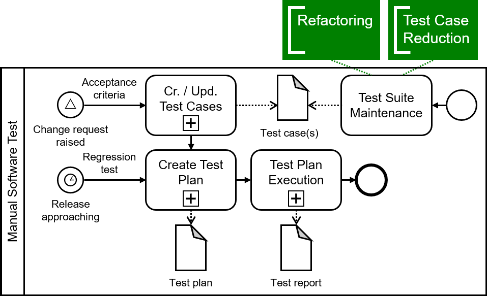

# Annotated Process Model

## Overview

The annotated process model is defined in [`process-model.pptx`](https://github.com/manual-testing-study/manual-testing-esec-fse-21/blob/main/process-model/process-model.pptx) and contains the following (sub-)processes.

### Manual Software Test Process

Rendered in [`process-model.png`](https://github.com/manual-testing-study/manual-testing-esec-fse-21/blob/main/process-model/process-model.png):

### Test Case Creation Subprocess

Rendered in [`test-case-creation.png`](https://github.com/manual-testing-study/manual-testing-esec-fse-21/blob/main/process-model/test-case-creation.png):

### Test Plan Creation Subprocess

Rendered in [`test-plan-creation.png`](https://github.com/manual-testing-study/manual-testing-esec-fse-21/blob/main/process-model/test-plan-creation.png):

### Test Plan Execution Subprocess

Rendered in [`test-plan-execution.png`](https://github.com/manual-testing-study/manual-testing-esec-fse-21/blob/main/process-model/test-plan-execution.png):

## Generate PDFs/PNGs

To generate the PDFs or PNGs from the PPTX file, simply perform the following steps:
1. Open [`process-model.pptx`](https://github.com/manual-testing-study/manual-testing-esec-fse-21/blob/main/process-model/process-model.pptx) in MS PowerPoint or LibreOffice
2. Right-click each grouped (sub-)process and select "Save as Picture" 
3. Select PDF or PNG as the export file format
